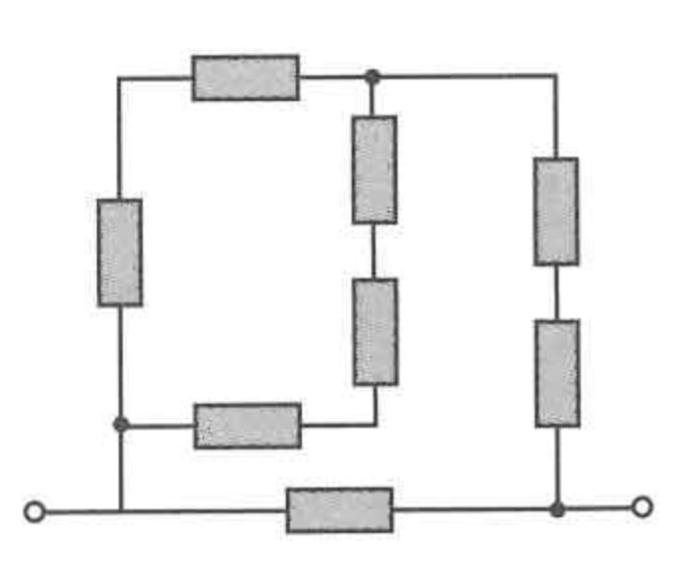
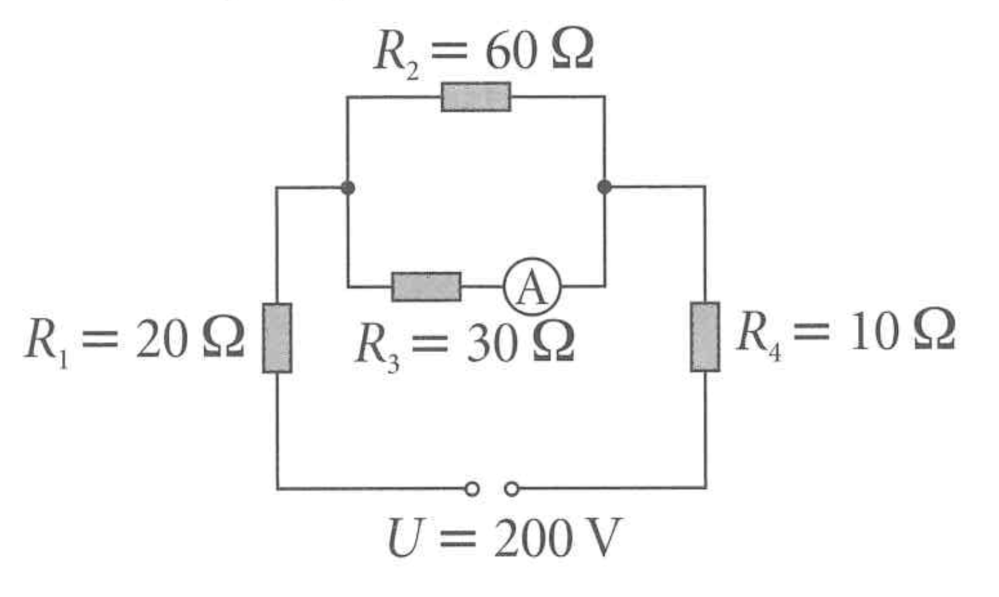
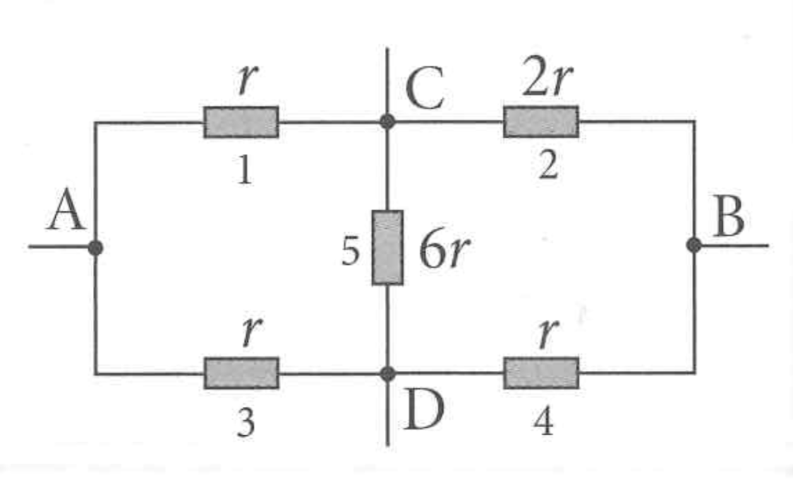
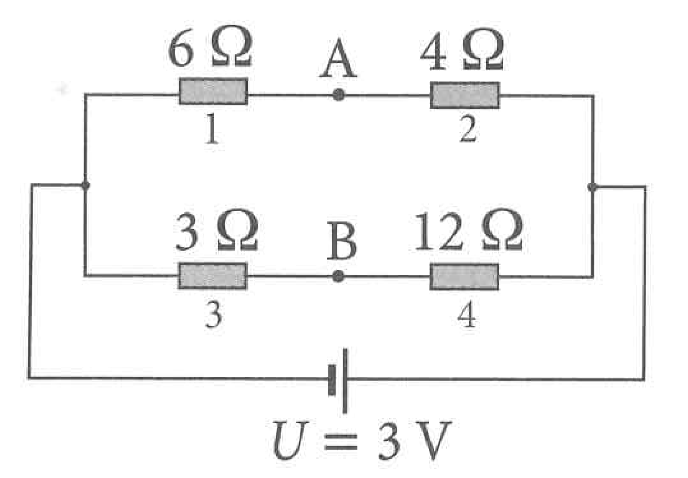

# Linear Circuit Analysis

## Problem 1

Calculate the equivalent resistance for the circuit shown in the figure. All resistors have a resistance of $5\ \Omega$.

## Problem 2

Calculate the equivalent resistance for the circuit shown in the figure. All resistors have a resistance of $3\ \Omega$.

## Problem 3

Calculate the equivalent resistance for the circuit shown in the figure. All resistors have a resistance of $10\ \Omega$.

## Problem 4

Calculate the voltage across resistor $R_3$ and the current flowing through this resistor.

## Problem 5

For the following circuit, calculate the equivalent resistance and the current flowing through ammeter A.

## Problem 6

For the following circuit, calculate the equivalent resistance and the currents across each of the resistors.

## Problem 7

For the following circuit, calculate the equivalent resistance and the potential difference between points A and B.

## Problem 8

Calculate the current flowing through the ammeter.

## Problem 9

Calculate the current flowing through the ammeter.

## Problem 10

Calculate the current flowing through the ammeter.

