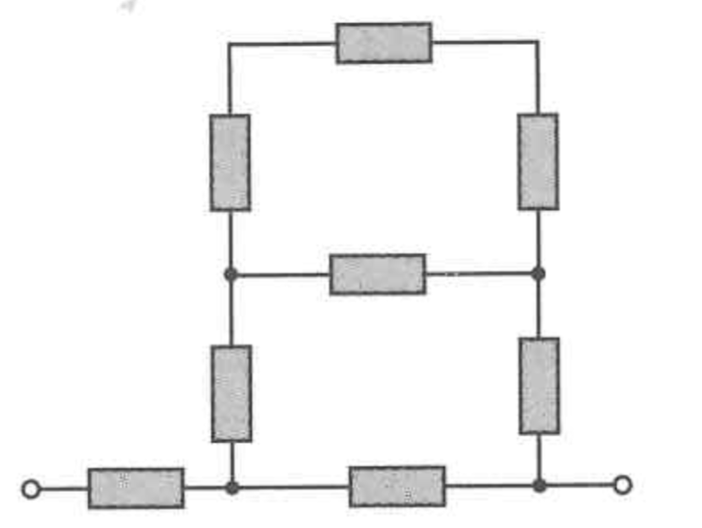
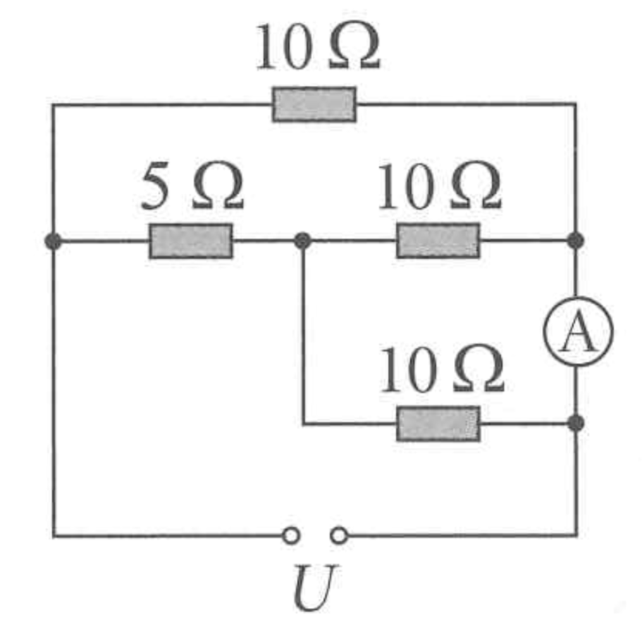
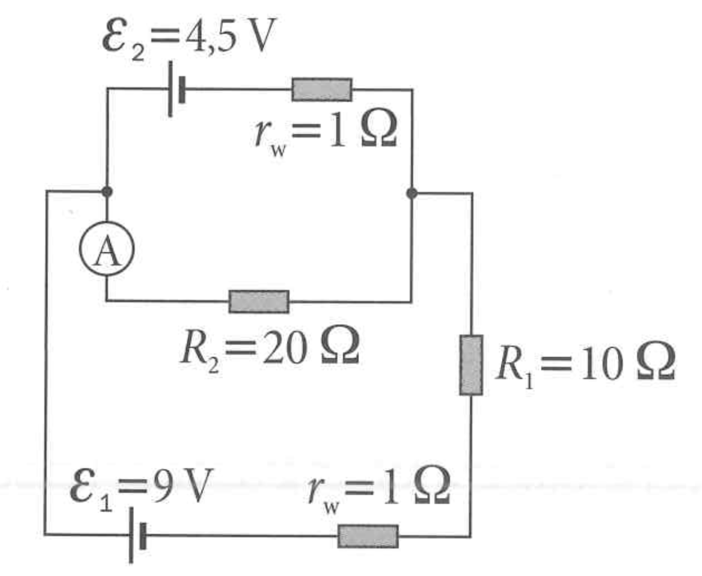

# **Lista – Analiza obwodów liniowych (zadania otwarte topologicznie)**

## Zadanie 1

Oblicz opór zastępczy dla układu przedstawionego na rysunku. Wszystkie rezystory mają opór 5 $\Omega$.

## Zadanie 2

Oblicz opór zastępczy dla układu przedstawionego na rysunku. Wszystkie rezystory mają opór 3 $\Omega$.

## Zadanie 3

Oblicz opór zastępczy dla układu przedstawionego na rysunku. Wszystkie rezystory mają opór 10 $\Omega$.

## Zadanie 4

Oblicz napięcie na rezystorze R3 oraz natężenie prądu płynącego przez ten rezystor.

## Zadanie 5

Dla poniższego układu oblicz opór zastępczy oraz natężenie prądu płynącego amperomierzem A.

## Zadanie 6

Dla poniższego układu oblicz opór zastępczy oraz natężenia prądów na każdym z rezystorów.

## Zadanie 7

Dla poniższego układu oblicz opór zastępczy oraz różnicę potencjałów między punktami A i B.

## Zadanie 8

Oblicz natężenie prądu płynącego przez amperomierz.

## Zadanie 9

Oblicz natężenie prądu płynącego przez amperomierz.

## Zadanie 10

Oblicz natężenie prądu płynącego przez amperomierz.

